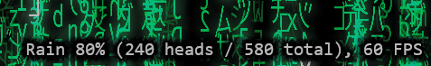
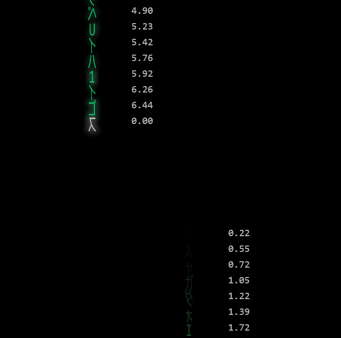

**MatrixRain**


**Short Description:**: I built this Win32/DirectX C++ Matrix-rain screensaver/demo as a test project to try out [SpecKit](https://github.com/github/spec-kit), which worked really well. The app supports configurable density, color schemes, and has some snazzy glow effects for that classic CRT vibe.

**Status:**: Active — complete demo with unit & integration tests.

**Table of Contents**
- **Overview**: Quick project summary and screenshot.
- **Hotkeys**: List of hotkeys and the features they control.
- **Debug helpers**: Some debug displays I found useful.
- **Specs & SpecKit**: Spec-driven development and extensive specs for the app.
- **Requirements**: Required tools and SDKs.
- **Build (Visual Studio)**: How to open and build in Visual Studio.
- **Build (VS Code)**: How to build from VS Code / command line.
- **Run**: Running the built app and tests.
- **Code Organization**: Where the major components live.
- **Contributing**: How to help.

**Overview**: 
MatrixRain is a small C++ project that implements the classic "Matrix" falling-character animation using a lightweight animation + rendering architecture. The screenshot above is included as `MatrixRain/MatrixRain.png` — the repository includes an image at that path which is used by this README.

**Hotkeys**

| Key | Action |
|-----|--------|
| Esc | Exit application |
| Space | Pause / resume animation |
| C | Cycle color schemes (green, blue, red, amber, color cycle)|
| S | Toggle statistics (FPS / other stats) |
| Alt + Enter | Toggle display mode (windowed ↔ fullscreen) |
| +/= | Increase density 5% |
| - | Decrease density 5% |
| ` (backtick / tilde) | Toggle debug fade-times overlay (works best with just a few streaks on screen)|

**Debug helpers**:

Press S to toggle the statistics display for nerdy debugging information: 


* Density (percentage of maximum streaks for the window size)
* Number of rain streak heads on screen
* Number of rain streaks (including partials still fading off) on screen
* FPS

Press ` (backtick) to toggle the per-character fade timer.  This gets pretty cluttered with more than just a few streaks, so you probably want to dial down the density first.



**Specs & SpecKit**:

- My main goal with this project was to learn about spec-driven development with [SpecKit](https://github.com/github/spec-kit).  Starting with a short description of the app's purpose and behavior, SpecKit generated a detailed [spec](specs/001-matrix-rain/spec.md) with five user stories, assigned priorities to them, and genreated acceptance criteria for each. It came up with a set of edge cases to be clarified and tested, and 27 functional requirements.  
- The next step was to start plan mode. Using the spec from the previous step, and some high-level implementation requirements from me (e.g., use DirectX), it generated a [plan](specs/001-matrix-rain/plan.md). It also did [research](specs/001-matrix-rain/research.md) into DX, text rendering options, etc. and generated a [data-model](specs/001-matrix-rain/data-model.md).
- SpecKit was then ready to generate [tasks](specs/001-matrix-rain/tasks.md)--lots of tasks; 192 of them. These were organized into implementation phases to achieve specific high-level outcomes, and also included annotation about which user story they accrued to and which tasks were parallelizable. 
- At this point, SpecKit was ready to start implementing tasks. It can work on individual tasks, whole phases, or anything in between. It will go in its recommended order, but you can override that if you like.
- Throughout the various stages of work, SpecKit is constantly cross-checking that the LLM's output remains aligned with the defined [constitution](.specify/memory/constitution.md), spec, plan, and related documents. Compared to working in Cline, this kept the LLM better focused and moving in the right direction. These files provide better, more specific context to the model throughout the journey. While Cline is very good, it is largely at the mercy of the current chat history which can rapidly lose critical context as the implementation moves forward.

SpecKit docs: https://github.com/github/spec-kit

**Requirements**:
- **OS**: Windows (tested on Windows 11).
- **Compiler / Build tools**: Visual Studio 2026 with C++ desktop workload (MSVC toolchain), Windows SDK.
- **Build system**: MSBuild (used by Visual Studio) and `msbuild` CLI.
- **Optional tools**: VS Code with C/C++ extension and the MSVC command-line toolchain available in PATH (or via Developer Command Prompt).

**Build (Visual Studio)**:
- Open the solution: `MatrixRain.sln` in Visual Studio.
- Select configuration `Debug` or `Release` and platform `x64`.
- Build the solution using the Build menu -> `Build Solution`.

**Build (VS Code)**
- Open the workspace file `MatrixRain.code-workspace` in VS Code.
- From the menu: `Terminal` -> `Run Task...` and choose `Build MatrixRain (Debug)` or `Build MatrixRain (Release)`.
- Or open the Command Palette (Ctrl+Shift+P) and run `Tasks: Run Task`, then pick the desired build task.

**Run**:
- After building, run the executable from `x64\Debug\MatrixRain.exe` or `x64\Release\MatrixRain.exe`.


**Tests**
- Unit and integration tests are in the `MatrixRainTests` project.
- To run tests with the Visual Studio Test Runner or `vstest.console.exe` (example):

```powershell
vstest.console.exe .\x64\Debug\MatrixRainTests.dll
```

**Code Organization**:
- `MatrixRain/` — Top-level app project (Win32 entry, resources, and launcher).
  - `main.cpp`, `MatrixRain.rc`, and project file `MatrixRain.vcxproj`.
- `MatrixRainCore/` — Core engine and subsystems (preferred place for unit-testing).
  - `include/MatrixRain/` — Public headers for core subsystems:
    - `AnimationSystem.h`, `Application.h`, `ApplicationState.h`, `CharacterSet.h`, `RenderSystem.h`, `Timer.h`, `Viewport.h`, etc.
  - `src/` — Implementation files organized by feature:
    - `animation/` (systems that drive streaks and characters)
    - `characters/` (character data, sets, constants)
    - `rendering/` (render loop, draw routines)
    - `input/`, `state/`, `ui/` — supporting systems
- `MatrixRainTests/` — Unit and integration tests.
- `specs/` — Human-readable specification files (generated/managed with SpecKit in our workflow).

**Development Notes**:
- The project uses precompiled headers (`pch.h` / `pch.cpp`) to speed builds; ensure PCH settings are preserved when importing files into the project.
- Error handling uses the project's `Ehm.*` facilities — see `MatrixRainCore/Ehm.h` for patterns and macros used throughout the codebase.
- Keep formatting and alignment consistent with existing code conventions when contributing.

**Contributing**:
- Fork, create a feature branch, and open a pull request against `001-matrix-rain` (or `main` as appropriate).
- Run unit and integration tests locally before submitting.
- If you're adding features that affect rendering, include a short spec in `specs/` describing behavior and configuration knobs.

