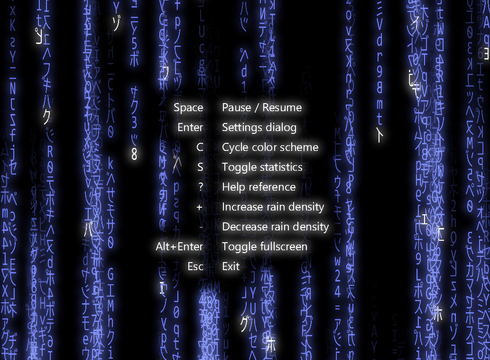
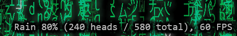
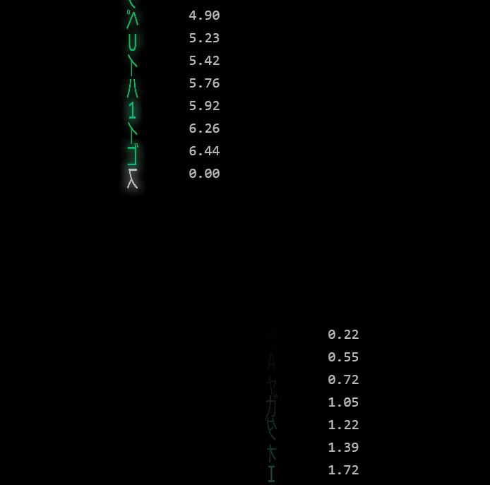

# MatrixRain

<!-- markdownlint-disable MD033 -->
<video src="https://github.com/user-attachments/assets/bb39535d-49a2-4c40-8d8e-56a37b4a8f1c" autoplay loop muted playsinline></video>
<!-- markdownlint-enable MD033 -->

I built this Win32/DirectX C++ Matrix-rain screensaver/demo as a test project to try out [SpecKit](https://github.com/github/spec-kit), which worked really well. The app supports configurable density, color schemes, and has some snazzy glow effects for that classic CRT vibe.

**Status:** Active — complete demo with unit & integration tests. Fully functional as both a standalone desktop app and Windows screensaver.

## Table of Contents

- [Overview](#overview) — Quick project summary and screenshot.
- [Screensaver Installation](#screensaver-installation) — How to install MatrixRain as a Windows screensaver.
- [Screensaver Usage](#screensaver-usage) — Command-line arguments and Control Panel integration.
- [Hotkeys](#hotkeys-desktop-mode-only) — List of hotkeys and the features they control (desktop mode).
- [Debug Helpers](#debug-helpers) — Some debug displays I found useful.
- [Specs & SpecKit](#specs--speckit) — Spec-driven development and extensive specs for the app.
- [Requirements](#requirements) — Required tools and SDKs.
- [Build (Visual Studio)](#build-visual-studio) — How to open and build in Visual Studio.
- [Build (VS Code)](#build-vs-code) — How to build from VS Code / command line.
- [Run](#run) — Running the built app and tests.
- [Code Organization](#code-organization) — Where the major components live.
- [Contributing](#contributing) — How to help.

## Overview

MatrixRain is a small C++ project that implements the classic "Matrix" falling-character animation using a lightweight animation + rendering architecture. It works as both a standalone desktop application and a fully-featured Windows screensaver with configurable settings. The screenshot above is included as `MatrixRain/MatrixRain.png` — the repository includes an image at that path which is used by this README.

## Screensaver Installation

After building the project, you'll find both `MatrixRain.exe` (standalone app) and `MatrixRain.scr` (screensaver) in the output directory (`x64\Debug` or `x64\Release`).

### Option 1: Install via File Explorer

1. Locate `MatrixRain.scr` in `x64\Debug` or `x64\Release`
2. Right-click `MatrixRain.scr` and select **Install**
3. Windows will open the Screen Saver Settings dialog with MatrixRain selected
4. Click **Settings** to configure options (density, color scheme, animation speed, glow effects)
5. Click **Preview** to test, then **OK** to save

### Option 2: Manual Installation

1. Copy `MatrixRain.scr` to `C:\Windows\System32\` (requires admin privileges)
2. Open **Control Panel** → **Appearance and Personalization** → **Change screen saver**
3. Select **MatrixRain** from the dropdown
4. Configure and save as above

## Screensaver Usage

MatrixRain supports the following command-line arguments:

| Argument | Description |
| -------- | ----------- |
| *(none)* | Run as desktop application with hotkeys enabled |
| `/?` | Display usage (command-line switches) |
| `/c` | Show settings dialog |

The following switches are part of the Windows screensaver protocol and are invoked automatically by the operating system. They are not intended for manual use:

| Argument | Description |
| ------------ | ----------- |
| `/s` | Screensaver mode (fullscreen, exit on input) |
| `/p <HWND>` | Preview mode in Control Panel window |
| `/c:<HWND>` | Settings dialog parented to Control Panel |
| `/a` | Password change (not supported, handled gracefully) |

### Settings Dialog Features

- **Density**: Control the number of falling character streaks (0-100%)
- **Animation Speed**: Adjust how fast characters fall (1-200%)
- **Glow Intensity**: Control the bloom effect strength (0-200%)
- **Glow Size**: Adjust bloom spread radius (50-200%)
- **Color Scheme**: Choose from green, blue, red, amber, or color cycle mode
- **Start Fullscreen**: Toggle whether app launches in fullscreen mode
- **Show Debug Stats**: Display FPS and density information (disabled in screensaver modes)
- **Show Fade Timers**: Display per-character fade countdown (disabled in screensaver modes)
- **Reset**: Restore all settings to defaults

### Live Overlay Mode

When MatrixRain is running as a desktop app, you can launch `/c` without an HWND to get a live configuration dialog that updates the animation in real-time as you adjust settings. Press **OK** to save changes, or **Cancel** to revert to previous values.

## Hotkeys (Desktop Mode Only)

Press `?` to show the hotkey reference overlay in-app:



| Key | Action |
| -------------------- | ------ |
| Space | Pause / resume animation |
| Enter | Open settings dialog (live overlay) |
| C | Cycle color schemes (green, blue, red, amber, color cycle) |
| S | Toggle statistics (FPS / other stats) |
| ? | Show hotkey reference overlay |
| + | Increase density 5% |
| - | Decrease density 5% |
| Alt + Enter | Toggle display mode (windowed ↔ fullscreen) |
| Esc | Exit application |

## Debug Helpers

Press S to toggle the statistics display for nerdy debugging information:



- Density (percentage of maximum streaks for the window size)
- Number of rain streak heads on screen
- Number of rain streaks (including partials still fading off) on screen
- FPS

Press ` (backtick) to toggle the per-character fade timer. This gets pretty cluttered with more than just a few streaks, so you probably want to dial down the density first.



## Specs & SpecKit

- My main goal with this project was to learn about spec-driven development with [SpecKit](https://github.com/github/spec-kit). Starting with a short description of the app's purpose and behavior, SpecKit generated a detailed [spec](specs/001-matrix-rain/spec.md) with five user stories, assigned priorities to them, and generated acceptance criteria for each. It came up with a set of edge cases to be clarified and tested, and 27 functional requirements.
- The next step was to start plan mode. Using the spec from the previous step, and some high-level implementation requirements from me (e.g., use DirectX), it generated a [plan](specs/001-matrix-rain/plan.md). It also did [research](specs/001-matrix-rain/research.md) into DX, text rendering options, etc. and generated a [data-model](specs/001-matrix-rain/data-model.md).
- SpecKit was then ready to generate [tasks](specs/001-matrix-rain/tasks.md)--lots of tasks; 192 of them. These were organized into implementation phases to achieve specific high-level outcomes, and also included annotation about which user story they accrued to and which tasks were parallelizable.
- At this point, SpecKit was ready to start implementing tasks. It can work on individual tasks, whole phases, or anything in between. It will go in its recommended order, but you can override that if you like.
- Throughout the various stages of work, SpecKit is constantly cross-checking that the LLM's output remains aligned with the defined [constitution](.specify/memory/constitution.md), spec, plan, and related documents. Compared to working in Cline, this kept the LLM better focused and moving in the right direction. These files provide better, more specific context to the model throughout the journey. While Cline is very good, it is largely at the mercy of the current chat history which can rapidly lose critical context as the implementation moves forward.

SpecKit docs: <https://github.com/github/spec-kit>

## Requirements

- **OS**: Windows (tested on Windows 11).
- **Compiler / Build tools**: Visual Studio 2026 with C++ desktop workload (MSVC toolchain), Windows SDK.
- **Build system**: MSBuild (used by Visual Studio) and `msbuild` CLI.
- **Optional tools**: VS Code with C/C++ extension and the MSVC command-line toolchain available in PATH (or via Developer Command Prompt).

## Build (Visual Studio)

- Open the solution: `MatrixRain.sln` in Visual Studio.
- Select configuration `Debug` or `Release` and platform `x64`.
- Build the solution using the Build menu -> `Build Solution`.

## Build (VS Code)

- Open the workspace file `MatrixRain.code-workspace` in VS Code.
- From the menu: `Terminal` -> `Run Task...` and choose `Build MatrixRain (Debug)` or `Build MatrixRain (Release)`.
- Or open the Command Palette (Ctrl+Shift+P) and run `Tasks: Run Task`, then pick the desired build task.

## Run

- After building, run the executable from `x64\Debug\MatrixRain.exe` or `x64\Release\MatrixRain.exe`.

### Tests

- Unit and integration tests are in the `MatrixRainTests` project.
- To run tests with the Visual Studio Test Runner or `vstest.console.exe` (example):

```powershell
vstest.console.exe .\x64\Debug\MatrixRainTests.dll
```

## Code Organization

- `MatrixRain/` — Top-level app project (Win32 entry, resources, and launcher).
  - `main.cpp`, `MatrixRain.rc`, and project file `MatrixRain.vcxproj`.
- `MatrixRainCore/` — Core engine and subsystems (preferred place for unit-testing).
  - All headers and source files in flat structure at root level:
    - `AnimationSystem.h/.cpp`, `Application.h/.cpp`, `ApplicationState.h/.cpp`, `CharacterSet.h/.cpp`, `RenderSystem.h/.cpp`, `Timer.h/.cpp`, `Viewport.h/.cpp`, etc.
  - `pch.h`/`pch.cpp` — Precompiled headers for faster builds
  - `Ehm.h`/`Ehm.cpp` — Error handling macros and utilities
- `MatrixRainTests/` — Unit and integration tests.
- `specs/` — Human-readable specification files (generated/managed with SpecKit in our workflow).

### Development Notes

- The project uses precompiled headers (`pch.h` / `pch.cpp`) to speed builds; ensure PCH settings are preserved when importing files into the project.
- Error handling uses the project's `Ehm.*` facilities — see `MatrixRainCore/Ehm.h` for patterns and macros used throughout the codebase.
- Keep formatting and alignment consistent with existing code conventions when contributing.

## Contributing

- Fork, create a feature branch, and open a pull request against `001-matrix-rain` (or `main` as appropriate).
- Run unit and integration tests locally before submitting.
- If you're adding features that affect rendering, include a short spec in `specs/` describing behavior and configuration knobs.


