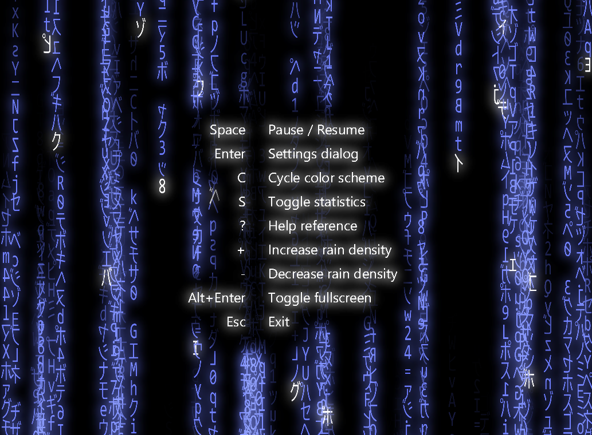
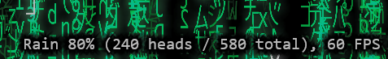

# MatrixRain

[](https://github.com/relmer/MatrixRain/actions/workflows/ci.yml)
[](https://github.com/relmer/MatrixRain/releases/latest)
[](LICENSE)
[](https://github.com/relmer/MatrixRain/releases)

<!-- markdownlint-disable MD033 -->
<video src="https://github.com/user-attachments/assets/bb39535d-49a2-4c40-8d8e-56a37b4a8f1c" autoplay loop muted playsinline></video>
<!-- markdownlint-enable MD033 -->

## Install

MatrixRain is available through winget:

```powershell
winget install relmer.MatrixRain
```

## About MatrixRain

I built this Win32/DirectX C++ Matrix-rain screensaver/demo as a test project to try out [SpecKit](https://github.com/github/spec-kit), which worked really well. The app supports configurable density, color schemes, multi-monitor rendering, and has some snazzy glow effects for that classic CRT vibe.

**Status:** Active — complete demo with unit & integration tests. Fully functional as both a standalone desktop app and Windows screensaver.

## What's New

| Version | Highlights |
| :---: | :--- |
| **1.7** | HDR support. MatrixRain now presents natively in HDR on monitors with Windows HDR turned on: streak heads and the bright glyphs behind them shine above normal white, while the rest of the rain keeps its familiar look. Glow and fades are now computed in linear light for smoother tails |
| **1.6** | Scanline fixes: the Style slider now looks the same on every monitor regardless of size or scaling, with no moiré. Switched to semantic versioning |
| **1.5** | Added customizable scanline effect and a custom color picker. Rebuilt settings dialog as a tabbed dialog with live FPS/GPU usage statistics as you tune the settings |
| **1.4** | Performance optimization release — pick which GPU to render on, plus Quality presets (Low/Medium/High/Custom with per-knob infotips) to dial back GPU load. Adds live multi-monitor toggle, frame cap on >60 Hz displays, and a themed two-column dialog overhaul |
| **1.3** | Multi-monitor support — independent, DPI-aware Matrix rain on every connected display in fullscreen and screensaver modes |
| **1.2** | Screensaver install/uninstall (`/install`, `/uninstall`) with UAC elevation and Group Policy detection |
| **1.1** | In-app overlays — usage dialog (`/?`), startup help hint, and `?` hotkey reference; multi-pass bloom glow with live glow-size control |
| **1.0** | winget distribution (`winget install relmer.MatrixRain`) and ARM64 native build |
| **0.9** | Windows screensaver mode (`/s`, `/c`, `/p`) with a live-updating settings dialog and registry-persisted configuration |

See [CHANGELOG.md](CHANGELOG.md) for the full release history.

## Table of Contents

- [What's New](#whats-new) — Highlights of the most recent significant features.
- [Overview](#overview) — Quick project summary and screenshot.
- [Screensaver Installation](#screensaver-installation) — How to install MatrixRain as a Windows screensaver.
- [Screensaver Usage](#screensaver-usage) — Command-line arguments and Control Panel integration.
- [Hotkeys](#hotkeys-desktop-mode-only) — List of hotkeys and the features they control (desktop mode).
- [Debug Helpers](#debug-helpers) — Some debug displays I found useful.
- [Specs & SpecKit](#specs--speckit) — Spec-driven development and extensive specs for the app.
- [Requirements](#requirements) — Required tools and SDKs.
- [Build (Visual Studio)](#build-visual-studio) — How to open and build in Visual Studio.
- [Build (VS Code)](#build-vs-code) — How to build from VS Code tasks.
- [Build (Command Line)](#build-command-line) — How to build and test from PowerShell.
- [Run](#run) — Running the built app and tests.
- [Code Organization](#code-organization) — Where the major components live.
- [Contributing](#contributing) — How to help.

## Overview

MatrixRain is a small C++ project that implements the classic "Matrix" falling-character animation using a lightweight animation + rendering architecture. It works as both a standalone desktop application and a fully-featured Windows screensaver with configurable settings. In fullscreen and screensaver modes it spans every connected display, rendering an independent, DPI-aware rain animation on each monitor. The video above is included as `assets/MatrixRainColors.mp4`.


## Screensaver Installation

After building the project, you'll find `MatrixRain.exe` in the output directory (`x64\Debug` or `x64\Release`).

To install as a screensaver:

```text
MatrixRain.exe /install
```

This copies the executable to `C:\Windows\System32\MatrixRain.scr`, sets it as the active screensaver, and opens the Screen Saver Settings dialog. A UAC elevation prompt will appear since writing to System32 requires admin privileges.

To uninstall:

```text
MatrixRain.exe /uninstall
```

This removes the `.scr` file from System32 and cleans up the screensaver registry entries. A confirmation message is displayed on completion.

> **Note:** Certain Group Policy settings can block screensaver use.  If a device lock or screensaver-blocking policy is detected, the install is aborted with an error message showing the specific policy. You can override the policy check with `/install /force`, but the policy may still block the screensaver from running.

## Screensaver Usage

MatrixRain supports the following command-line arguments:

| Argument | Description |
| -------------- | ----------- |
| *(none)* | Run as desktop application with hotkeys enabled |
| `/?` | Display usage (command-line switches) |
| `/install` | Install MatrixRain as system screensaver |
| `/uninstall` | Uninstall MatrixRain screensaver |
| `/force` | Skip policy checks (use with `/install`) |

The following switches are part of the Windows screensaver protocol and are invoked automatically by the operating system. They are not intended for manual use:

| Argument | Description |
| ------------ | ----------- |
| `/s` | Screensaver mode (fullscreen, exit on input) |
| `/p <HWND>` | Preview mode in Control Panel window |
| `/c[:<HWND>]` | Settings dialog parented to HWND, if present |
| `/a` | Password change (not supported, handled gracefully) |

### Settings Dialog Features

- **Density**: Control the number of falling character streaks (0-100%)
- **Animation Speed**: Adjust how fast characters fall (1-100%)
- **Glow Intensity**: Control the bloom effect strength (1-200%)
- **Glow Size**: Adjust bloom spread radius (50-200%)
- **Color Scheme**: Choose from green, blue, red, amber, color cycle mode, or a custom color from the color picker
- **Start Fullscreen**: Toggle whether app launches in fullscreen mode
- **Show Debug Stats**: Display FPS and density information (disabled in screensaver modes)
- **HDR highlights**: Auto or Off; Auto lets highlights go above normal white on monitors with Windows HDR turned on
- **Brightness** (under HDR highlights): how bright highlights get, up to what the monitor can show (0-100%)
- **Reset**: Restore all settings to defaults

### HDR

On a monitor with Windows HDR turned on, MatrixRain presents in HDR on its
own, one monitor at a time, and follows HDR being turned on or off within
a second.

- **Trail brightness** follows the Windows **SDR content brightness**
  slider (Settings > System > Display > HDR), the same as other SDR
  content, so the rain matches the rest of your desktop.
- **HDR highlights: Auto** (the default) lets the head of each streak,
  and the brightest glyphs just behind it, shine brighter than normal
  white, in their own color. **Brightness** sets how far, up to the
  monitor's peak. **Off** keeps everything at normal white, exactly as
  on an SDR monitor.
- **How much highlights stand out** depends on the room between the SDR
  content brightness and the monitor's peak. A lower SDR content
  brightness leaves more room.
- SDR monitors are not affected by any of this. When no monitor has HDR
  on, the HDR controls gray out and the dialog says why, with a link to
  the Windows HDR settings if a monitor supports HDR but has it off.

### Live Overlay Mode

When MatrixRain is running as a desktop app, you can launch `/c` without an HWND to get a live configuration dialog that updates the animation in real-time as you adjust settings. Press **OK** to save changes, or **Cancel** to revert to previous values.

## Hotkeys (Desktop Mode Only)

Press `?` to show the hotkey reference overlay in-app:



| Key | Action |
| -------------------- | ------ |
| Space | Pause / resume animation |
| Enter | Open settings dialog (live overlay) |
| C | Cycle color schemes (green, blue, red, amber, color cycle) |
| S | Toggle statistics (FPS / other stats) |
| ? | Show hotkey reference overlay |
| + | Increase density 5% |
| - | Decrease density 5% |
| Alt + Enter | Toggle display mode (windowed ↔ fullscreen) |
| Esc | Exit application |

## Debug Helpers

Press S to toggle the statistics display for nerdy debugging information:



- Density (percentage of maximum streaks for the window size)
- Number of rain streak heads on screen
- Number of rain streaks (including partials still fading off) on screen
- FPS

## Specs & SpecKit

- My main goal with this project was to learn about spec-driven development with [SpecKit](https://github.com/github/spec-kit). Starting with a short description of the app's purpose and behavior, SpecKit generated a detailed [spec](specs/001-matrix-rain/spec.md) with five user stories, assigned priorities to them, and generated acceptance criteria for each. It came up with a set of edge cases to be clarified and tested, and 27 functional requirements.
- The next step was to start plan mode. Using the spec from the previous step, and some high-level implementation requirements from me (e.g., use DirectX), it generated a [plan](specs/001-matrix-rain/plan.md). It also did [research](specs/001-matrix-rain/research.md) into DX, text rendering options, etc. and generated a [data-model](specs/001-matrix-rain/data-model.md).
- SpecKit was then ready to generate [tasks](specs/001-matrix-rain/tasks.md)--lots of tasks; 192 of them. These were organized into implementation phases to achieve specific high-level outcomes, and also included annotation about which user story they accrued to and which tasks were parallelizable.
- At this point, SpecKit was ready to start implementing tasks. It can work on individual tasks, whole phases, or anything in between. It will go in its recommended order, but you can override that if you like.
- Throughout the various stages of work, SpecKit is constantly cross-checking that the LLM's output remains aligned with the defined [constitution](.specify/memory/constitution.md), spec, plan, and related documents. Compared to working in Cline, this kept the LLM better focused and moving in the right direction. These files provide better, more specific context to the model throughout the journey. While Cline is very good, it is largely at the mercy of the current chat history which can rapidly lose critical context as the implementation moves forward.

SpecKit docs: <https://github.com/github/spec-kit>

## Requirements

- **OS**: Windows (tested on Windows 11).
- **Compiler / Build tools**: Visual Studio 2026 with C++ desktop workload (MSVC toolchain), Windows SDK.
- **Build system**: MSBuild (used by Visual Studio) and `msbuild` CLI.
- **Optional tools**: VS Code with C/C++ extension and the MSVC command-line toolchain available in PATH (or via Developer Command Prompt).

## Build (Visual Studio)

- Open the solution: `MatrixRain.sln` in Visual Studio.
- Select configuration `Debug` or `Release` and platform `x64`.
- Build the solution using the Build menu -> `Build Solution`.

## Build (VS Code)

- Open the workspace file `MatrixRain.code-workspace` in VS Code.
- From the menu: `Terminal` -> `Run Task...` and choose `Build Debug (current arch)` or `Build Release (current arch)`.
- Or open the Command Palette (Ctrl+Shift+P) and run `Tasks: Run Task`, then pick the desired build task.

Every VS Code build/test task is a thin wrapper around the PowerShell scripts described below, so the two paths are equivalent.

## Build (Command Line)

The `scripts/` folder holds the build and test entry points. `Invoke-MatrixRainBuild.ps1` is the canonical way to build from a terminal:

```powershell
.\scripts\Invoke-MatrixRainBuild.ps1
```

With no arguments this builds `Debug` for the current architecture. It locates the VS 2026 MSBuild via `vswhere`, verifies `MatrixRain.exe` was produced, and prints a per-configuration summary.

### Build parameters

| Parameter | Values | Default | Description |
| --------- | ------ | ------- | ----------- |
| `-Target` | `Build`, `Clean`, `Rebuild`, `BuildAllRelease`, `CleanAll`, `RebuildAllRelease` | `Build` | MSBuild target. The `*All*` variants cover both x64 and ARM64. |
| `-Configuration` | `Debug`, `Release` | `Debug` | Build configuration. |
| `-Platform` | `x64`, `ARM64`, `Auto` | `Auto` | `Auto` resolves to the host architecture. |

Common invocations:

```powershell
# Release build for the current architecture
.\scripts\Invoke-MatrixRainBuild.ps1 -Configuration Release

# Explicit x64 rebuild from clean
.\scripts\Invoke-MatrixRainBuild.ps1 -Configuration Release -Platform x64 -Target Rebuild

# Release for both architectures (matches the release workflow)
.\scripts\Invoke-MatrixRainBuild.ps1 -Target BuildAllRelease

# Clean every configuration and platform
.\scripts\Invoke-MatrixRainBuild.ps1 -Target CleanAll
```

If the MSVC ARM64 build tools are not installed, the `*All*` targets report ARM64 as `SKIPPED` and continue with x64 rather than failing.

On an ARM64 host, ARM64 builds automatically pass `PreferredToolArchitecture=arm64` so the native compiler is used.

### Versioning

MatrixRain uses manual semantic versioning — `MAJOR.MINOR.PATCH`, bumped by hand when cutting a release. Builds never modify `Version.h`, so a build leaves your working tree clean.

- **MAJOR** — incompatible / milestone changes
- **MINOR** — backward-compatible feature additions
- **PATCH** — backward-compatible fixes

To bump, edit `MatrixRainCore/Version.h` and rebuild:

```cpp
#define VERSION_MAJOR 1
#define VERSION_MINOR 7
#define VERSION_PATCH 0
#define VERSION_YEAR  2026
```

The version flows into the app via `VERSION_WSTRING` (shown in the `/?` usage text and the overlay) and into the executable's resource block via `MatrixRain/MatrixRain.rc`. `VERSION_BUILD_TIMESTAMP` — the compiler's `__DATE__ " " __TIME__` — identifies an individual compile when that granularity is needed.

The release workflow (`.github/workflows/release.yml`) validates that the `v#.#.#` git tag matches `Version.h` and fails the release on a mismatch, so bump the header in the same commit you tag.

### Running tests from the command line

`Invoke-MatrixRainTests.ps1` runs the test assembly through `vstest.console.exe` from the VS 2026 install. Build first — it fails fast if the test assembly is missing:

```powershell
.\scripts\Invoke-MatrixRainTests.ps1 -Configuration Debug -Platform Auto
```

| Parameter | Values | Default | Description |
| --------- | ------ | ------- | ----------- |
| `-Configuration` | `Debug`, `Release` | `Debug` | Which build output to test. |
| `-Platform` | `x64`, `ARM64`, `Auto` | `Auto` | `Auto` resolves to the host architecture. |
| `-RunSettings` | *(path)* | `MatrixRainTests.runsettings` | Runsettings file, relative to the repo root. |
| `-Parallel` | *(switch)* | off | Pass `/Parallel` to `vstest.console.exe`. |

Both scripts exit non-zero on failure, so they can be chained in CI or a local pre-commit check:

```powershell
.\scripts\Invoke-MatrixRainBuild.ps1 -Configuration Release -Platform x64
if ($LASTEXITCODE -eq 0) { .\scripts\Invoke-MatrixRainTests.ps1 -Configuration Release -Platform x64 }
```

## Run

- After building, run the executable from `x64\Debug\MatrixRain.exe` or `x64\Release\MatrixRain.exe`.

### Tests

- Unit and integration tests are in the `MatrixRainTests` project.
- Preferred: use the helper script, which resolves `vstest.console.exe` for you — see [Running tests from the command line](#running-tests-from-the-command-line).

```powershell
.\scripts\Invoke-MatrixRainTests.ps1 -Configuration Debug -Platform x64
```

- Tests also run from the Visual Studio Test Runner, or by invoking `vstest.console.exe` directly:

```powershell
vstest.console.exe .\x64\Debug\MatrixRainTests.dll
```

## Code Organization

- `MatrixRain/` — Top-level app project (Win32 entry, resources, and launcher).
  - `main.cpp`, `MatrixRain.rc`, and project file `MatrixRain.vcxproj`.
- `MatrixRainCore/` — Core engine and subsystems (preferred place for unit-testing).
  - All headers and source files in flat structure at root level:
    - `AnimationSystem.h/.cpp`, `Application.h/.cpp`, `ApplicationState.h/.cpp`, `CharacterSet.h/.cpp`, `RenderSystem.h/.cpp`, `Timer.h/.cpp`, `Viewport.h/.cpp`, etc.
  - `pch.h`/`pch.cpp` — Precompiled headers for faster builds
  - `Ehm.h`/`Ehm.cpp` — Error handling macros and utilities
- `MatrixRainTests/` — Unit and integration tests.
- `scripts/` — PowerShell build and test entry points (see [Build (Command Line)](#build-command-line)).
  - `Invoke-MatrixRainBuild.ps1` — Build/clean/rebuild wrapper around MSBuild.
  - `Invoke-MatrixRainTests.ps1` — Test runner wrapper around `vstest.console.exe`.
  - `VSTools.ps1` — Shared helpers that locate the VS 2026 toolchain via `vswhere`.
- `specs/` — Human-readable specification files (generated/managed with SpecKit in our workflow).

### Development Notes

- The project uses precompiled headers (`pch.h` / `pch.cpp`) to speed builds; ensure PCH settings are preserved when importing files into the project.
- Error handling uses the project's `Ehm.*` facilities — see `MatrixRainCore/Ehm.h` for patterns and macros used throughout the codebase.
- Keep formatting and alignment consistent with existing code conventions when contributing.

## Contributing

- Fork, create a feature branch, and open a pull request against `master`.
- Run unit and integration tests locally before submitting.
- If you're adding features that affect rendering, include a short spec in `specs/` describing behavior and configuration knobs.


